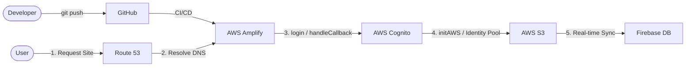

## Production-Ready AWS Serverless Web Application

A serverless web app I built for a private organization to manage documents, meeting schedules, and announcements replacing a WhatsApp group and scattered PDF files.

## What it does

Users log in with their credentials and get access to:
- Announcements and upcoming events
- Monthly schedules (editable by assigned members)
- Group assignments
- Protected PDF documents

Access is role-based regular users see documents, admins can upload and edit content, and specific roles can edit only their section.

## Stack

The frontend is plain HTML, CSS and JavaScript. Authentication and infrastructure are handled entirely on AWS:

- Cognito with PKCE flow for authentication and group-based permissions
- S3 for document storage, accessed through short-lived pre-signed URLs so files are never publicly accessible
- Amplify for hosting and CI/CD — connected to GitHub so every push to main deploys automatically
- Route 53 for the custom domain

## How auth works

Login uses the Cognito Hosted UI with PKCE (no client secret exposed). After authentication, the app exchanges the authorization code for tokens, uses the ID token to retrieve temporary AWS credentials from an Identity Pool, and uses those credentials to access S3 directly from the browser.

Users are assigned to Cognito groups (admin, programas, audio, acomodadores, etc.) and the app reads group membership from the decoded JWT to show or hide functionality.

## Work in progress

The monthly schedule editor currently runs on Firebase Realtime Database. I'm migrating it to DynamoDB to keep the whole stack on AWS.

## Live

[Live Project Demo](https://alacant-nordeste.com) — authentication required

## Architecture Diagram

